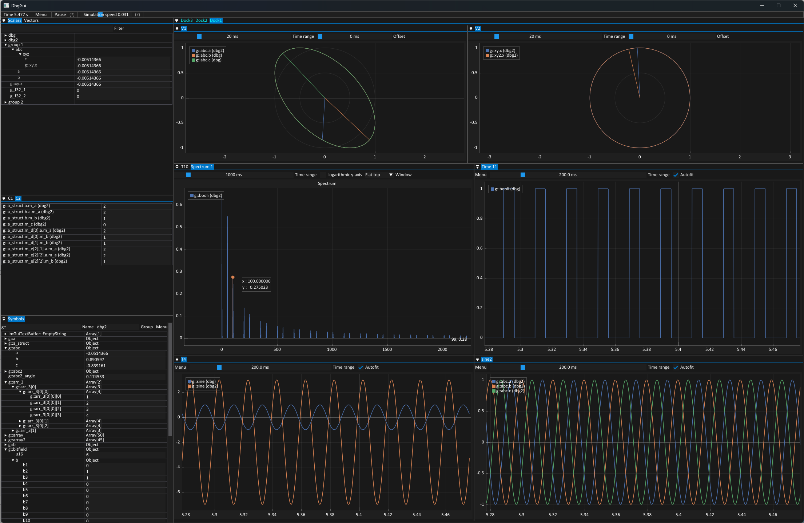

# DbgGui

Developer GUI for inspecting and plotting live program data on Windows and
Linux.



## Build

Install [uv](https://docs.astral.sh/uv/) and
[just](https://github.com/casey/just), then run:

```sh
just setup build
just build
just test build
```

## Usage

Include `DbgGui/dbg_gui.h`, create the GUI with the simulation sample time,
register any explicit signals, and submit samples from the simulation loop:

```cpp
DbgGui_create(sample_time);
DbgGui_startUpdateLoop();

while (!DbgGui_isClosed()) {
    updateSimulation();
    DbgGui_sampleWithTimestamp(simulation_time);
}
```

The loop above is suitable when closing the GUI should also end a standalone
simulation. When DbgGui is embedded in a simulator, the simulator owns the
lifetime instead: sample from its update callback and call `DbgGui_close()`
from its termination callback. It is not necessary to close DbgGui in response
to `DbgGui_isClosed()`.

DbgGui discovers global variables from PDB debug information on Windows and
DWARF debug information on Linux. Keep values that need to be inspected in
global or namespace scope with their concrete types visible in the debug
information.

See `src/test_main.c` and `src/test_main.cpp` for complete C and C++ examples.
